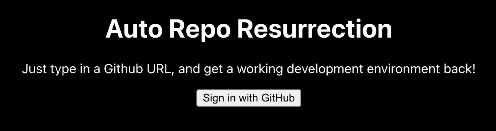
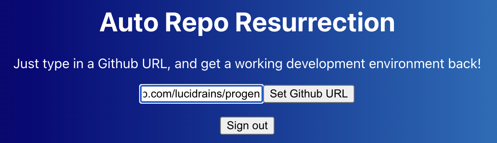
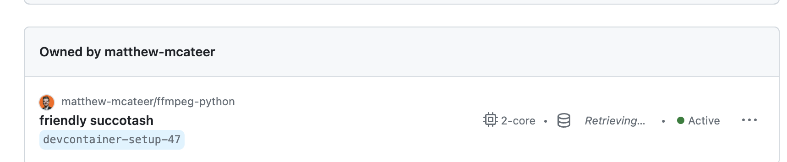

<div id="top"></div>

<!-- PROJECT SHIELDS
*** I'm using markdown "reference style" links for readability.
*** Reference links are enclosed in brackets [ ] instead of parentheses ( ).
*** See the bottom of this document for the declaration of the reference variables
*** for contributors-url, forks-url, etc. This is an optional, concise syntax you may use.
*** https://www.markdownguide.org/basic-syntax/#reference-style-links
-->

[![Contributors][contributors-shield]][contributors-url]
[![Forks][forks-shield]][forks-url]
[![Stargazers][stars-shield]][stars-url]
[![Issues][issues-shield]][issues-url]
[![Apache License][license-shield]][license-url]
[![LinkedIn][linkedin-shield]][linkedin-url]
[![Maintainability Rating][maintainability-shield]][maintainability-url]
[![Technical Debt][technical-debt-shield]][technical-debt-url]
[![Lines of Code][lines-of-code-shield]][lines-of-code-url]
[![Code Smells][code-smells-shield]][code-smells-url]
[![Security Rating][security-rating-shield]][security-rating-url]
[![Bugs][bugs-shield]][bugs-url]
[![Vulnerabilities][vulnerabilities-shield]][vulnerabilities-url]
[![Duplicated Lines (%)][duplicated-lines-shield]][duplicated-lines-url]
[![Reliability Rating][reliability-rating-shield]][reliability-rating-url]

<!-- PROJECT LOGO -->

<br />
<div align="center">
  <a href="https://github.com/matthew-mcateer/BioMLHackathon_ResurrectionSquad">
    
  </a>

<h3 align="center">BioMLHackathon ResurrectionSquad</h3>

  <p align="center">
    Project for the <a href="https://hackathon.bio/">Bio X AI Hackathon</a>. All about resurrecting old abandonware repos, and reducing the effort to get them up and running again.
    <br />
    <a href="https://github.com/matthew-mcateer/BioMLHackathon_ResurrectionSquad"><strong>Explore the docs »</strong></a>
    <br />
    <br />
    <a href="#usage">View Demo</a>
    ·
    <a href="https://github.com/matthew-mcateer/BioMLHackathon_ResurrectionSquad/issues">Report Bug</a>
    ·
    <a href="https://github.com/matthew-mcateer/BioMLHackathon_ResurrectionSquad/issues">Request Feature</a>
  </p>
</div>

<!-- TABLE OF CONTENTS -->

<details>
  <summary>Table of Contents</summary>
  <ol>
    <li>
      <a href="#about-the-project">About The Project</a>
      <ul>
        <li><a href="#built-with">Built With</a></li>
      </ul>
    </li>
    <li>
      <a href="#getting-started">Getting Started</a>
      <ul>
        <li><a href="#prerequisites">Prerequisites</a></li>
        <li><a href="#installation">Installation</a></li>
      </ul>
    </li>
    <li><a href="#usage">Usage</a></li>
    <li><a href="#roadmap">Roadmap</a></li>
    <li><a href="#contributing">Contributing</a></li>
    <li><a href="#license">License</a></li>
    <li><a href="#contact">Contact</a></li>
    <li><a href="#acknowledgments">Acknowledgments</a></li>
  </ol>
</details>


<!-- ABOUT THE PROJECT -->

## About The Project


A project built for resurrecting the countless abandonware repos littering GitHub.
The goal is to make it easier to turn any repo, no matter how old, and turn it into a working GitHub Codespace.

<p align="right">(<a href="#top">back to top</a>)</p>

### Built With

* [Python](https://www.python.org/)
* [NextJS](https://nextjs.org/)
* [OpenAI](https://pytorch.org/)
* [FastAPI](https://fastapi.tiangolo.com/)
* [React](https://reactjs.org/)
* [LangChain](https://docs.langchain.com/docs/)
* [Supabase](https://supabase.com/)
* [Docker](https://www.docker.com/)
* [GitHub Codespaces](https://github.com/codespaces)
* [Postmark](https://postmarkapp.com/)
* [Celery](https://docs.celeryq.dev/en/stable/getting-started/first-steps-with-celery.html#first-steps)
* [RabbitMQ](https://www.rabbitmq.com/)
* [Heroku](https://www.heroku.com/)


<p align="right">(<a href="#top">back to top</a>)</p>


<!-- GETTING STARTED -->
## Getting Started

For running this project locally, you can skip ahead to the [Usage](#usage) section.

To get a local copy up and running follow these simple steps:

### Prerequisites

Here is a list of prerequisites you need to install before you can start using the examples in this repo.

* python 3.9 or later
* node 14.17.0 or later
* NPX 7.19.1 or later

### Installation

1. First, Fork/Clone the repository.

2. Export the following API keys:
  
  your [OpenAI API key](https://platform.openai.com/account/api-keys)
  
  ```bash
  export OPENAI_API_KEY=<your-api-key>
  ```

  your [Anthropic API key](https://console.anthropic.com/account/keys)
  
  ```bash
  export ANTHROPIC_API_KEY=<your-api-key>
  ```
  
  Your [GitHub access token (classic)](https://docs.github.com/en/authentication/keeping-your-account-and-data-secure/creating-a-personal-access-token) (make sure it has the `codespace`and `repo` scopes):
  
  ```bash
  export GH_ACCESS_TOKEN=<your-api-key>
  ```
  <details>

  <summary><b>Getting your properly-scoped GitHub Access token (click to expand)</b></summary>

  - First, log in to your GitHub account.
  - Click on your profile photo in the upper right corner of any page.
  - From the dropdown menu, select "Settings."
  - On the settings page, find "Developer settings" at the bottom of the left-hand side menu and click it.
  - Now you should see "Personal access tokens" on the left-hand side menu, click it (click the "classic" tokens).
  - Click "Generate new token" on the Personal access tokens page.
  - In the "Note" field, enter a descriptive name for this token that will help you recognize its purpose later (e.g., "Token for forking and Codespaces").
  - To choose the required permissions, you'll need to select the following scopes:
    - For forking repositories, you will need the "repo" scope which includes 'public_repo' and others.
    - To create GitHub Codespaces, you will need the 'codespaces' scope which will allow "full access to managing user codespaces."
    Therefore, you should select both 'repo' and 'codespaces'.

  - Scroll down and click "Generate token" at the bottom of the page.
  - After you click the "Generate token" button, GitHub will display your new personal access token. Make sure you copy this token value and store it in a secure location. GitHub will not show the token to you again.


  </details>

  Your `CELERY_BROKER_URL`:
  
  ```bash
  export CELERY_BROKER_URL=<your-api-key>
  ```
  <details>
  
  <summary><b>Getting your </b><code>CELERY_BROKER_URL</code><b> (click to expand)</b></summary>

  If you're using [RabbitMQ](http://www.rabbitmq.com/download.html), you can use `export CELERY_BROKER_URL=pyamqp://guest@localhost//`.
  The demo version of this project is using a [CloudAMQP](https://www.cloudamqp.com/) instance from Heroku (the free "Little Lemur" tier).

  Or if you're using redis, you can use `docker run -d -p 6379:6379 redis && export CELERY_BROKER_URL=redis://localhost:6379/0`.

  </details>

  Your `POSTMARK_API_KEY`:
  
  ```bash
  export POSTMARK_API_KEY=<your-api-key>
  ```
  <details>
  
  <summary><b>Getting your </b><code>POSTMARK_API_KEY</code><b> (click to expand)</b></summary>

  Set up a https://postmarkapp.com/ account, and see [the developer documentation](https://postmarkapp.com/developer/api/overview).

  </details>


1. Install the python dependencies.

  ```bash
  $ cd backend
  $ python3.9 -m venv env
  $ source env/bin/activate
  (env)$ pip install -r requirements.txt
  ```

4. Make sure that you have `npx` installed:
    
  ```bash
  $ npm install -g npx
  ```

5. Enter the `frontend` directory and install the frontend dependencies:

  ```bash
  $ cd frontend
  $ npm i 
  $ npm run build
  ```

6. Start up the Celery worker in one terminal window (your **1st**):

  ```bash
  $ cd backend
  $ (env)$ celery --app app.tasks worker --loglevel INFO
  ```

7. In a **2nd** terminal windown, run the server-side FastAPI app:

  ```bash
  $ cd backend
  $ (env)$ python main.py
  ```
  Navigate to [http://localhost:8000](http://localhost:8000)


8. In a **3rd** terminal window, run the client-side React app:

  ```bash
  $ cd frontend
  $ npm install
  $ npm run start
  ```
  
8. _**Navigate to [http://localhost:3000](http://localhost:3000) to see the app running in your browser.**_

<p align="right">(<a href="#top">back to top</a>)</p>


<!-- USAGE EXAMPLES -->
## Usage

In order to start this project locally, you'll need to start the frontend and then the backend.



First, follow the [installation](#installation) instructions above.

Navigate to [http://localhost:3000](http://localhost:3000) to see the app running in your browser.

Sign into GitHub, after which you'll be greeted with the below page.



You can enter in a GitHub repo URL of your choice. At the moment the default is `https://github.com/richard-peacock/sequence_record_parsing`.

Include with this information your GitHub Access token (make sure it has the `repos` and `codespaces` scopes enabled), as well as your email. 

This will trigger the creation of the GitHub codespace.

If you navigate to the [GitHub Codespaces Dashboard](https://github.com/codespaces), you should see it being created (will resemble the below).




<!-- ROADMAP -->
## Roadmap

The scope of this project is admittedly quite large, so we've broken it down into a few phases:

- ✅ Embedding Map of Bioinformatics tools ( [view here](https://fancy-baklava-ee6d10.netlify.app/3d_embedding_exploration_tool) )
- ✅ Setting up a workflow for generating dev environments from an arbitrary repo
    - ✅ Creating a fork with a `dockerfile`, `devcontainer.json`, and anything else needed for a GitHub Codespace
  - ✅ Automatically Generated Dev Environments using GPT-4 (or Claude 100k)
  - 🚧 Get running environments built without error >50% of the time
- ✅ Automatically Refactoring Code using GPT-4 (or Claude 100k)
- 🚧 Translating languages using GPT-4 (or Claude 100k)
  - ✅ Nextflow-to-Flyte Translaton
  - 🚧 Nextflow-to-Snakemake Translaton
  - 🚧 Nextflow-to-Redun Translaton
  - 🚧 Nextflow-to-CWL Translaton
  - 🚧 MATLAB-to-Python Translaton
- 🚧 Improving the UI/UX of the above.

See the [open issues](https://github.com/matthew-mcateer/BioMLHackathon_ResurrectionSquad/issues) for a full list of proposed features (and known issues).

<p align="right">(<a href="#top">back to top</a>)</p>

<!-- CONTRIBUTING -->
## Contributing

If you have a suggestion that would make this better, please fork the repo and create a pull request.
You can also simply open an issue with the tag "enhancement".
Don't forget to give the project a star! Thanks again!

1. Fork the Project
2. Create your Feature Branch (`git checkout -b feature/AmazingFeature`)
3. Commit your Changes (`git commit -m 'Add some AmazingFeature'`)
4. Push to the Branch (`git push origin feature/AmazingFeature`)
5. Open a Pull Request

<p align="right">(<a href="#top">back to top</a>)</p>

<!-- LICENSE -->
## License

Distributed under the MIT License. See [`LICENSE`](LICENSE) for more information.

<p align="right">(<a href="#top">back to top</a>)</p>


<!-- CONTACT -->
## Contact

Matthew Mcateer (Author) - [@MatthewMcAteer0](https://twitter.com/MatthewMcAteer0) - bioml@5cubelabs.us

Project Link: [https://github.com/matthew-mcateer/BioMLHackathon_ResurrectionSquad](https://github.com/matthew-mcateer/BioMLHackathon_ResurrectionSquad)

<p align="right">(<a href="#top">back to top</a>)</p>


<!-- ACKNOWLEDGMENTS -->
## Acknowledgments

We'd like to thank everyone for their contributions to this project and the hackathon.

<a href="https://github.com/matthew-mcateer">
  
</a>

<a href="https://github.com/ashenafee">
  
</a>

<a href="https://github.com/Shubhamai">
  
</a>

<a href="https://github.com/asapsav">
  
</a>

<a href="https://github.com/lai-joyce">
  
</a>


We would also like to thank the organizers of the [Bio X AI Hackathon](https://hackathon.bio/) for putting on such a great event.

* [Chelsea Voss](https://twitter.com/csvoss) - [OpenAI](https://openai.com/)
* [Michael Retchin](https://twitter.com/MichaelRetchin) - [Nucleate](https://nucleate.xyz/)
* [Tess van Stekelenburg](https://twitter.com/velvetatom) - [Lux Capital](https://www.luxcapital.com/)
* [Niccolo Zanchelli](https://twitter.com/nc_znc) - [OpenBioML](https://www.openbioml.org/)
* [Katie Link](https://twitter.com/katieelink) - [HuggingFace](https://huggingface.co/)
* [Alfredo Andere](https://twitter.com/AlfredoAndere) - [LatchBio](https://latch.bio/)
* [Anton Troynikov](https://twitter.com/atroyn) - [Chroma](https://docs.trychroma.com/)
* [Lan Jiang](https://www.luxcapital.com/people/lan-jiang) - [Lux Capital](https://www.luxcapital.com/)
* [Joshua Meier](https://twitter.com/joshim5) - [AbSci](https://www.absci.com/)

<p align="right">(<a href="#top">back to top</a>)</p>


<!-- MARKDOWN LINKS & IMAGES -->
<!-- https://www.markdownguide.org/basic-syntax/#reference-style-links -->

[contributors-shield]: https://img.shields.io/github/contributors/matthew-mcateer/BioMLHackathon_ResurrectionSquad.svg?style=for-the-badge
[contributors-url]: https://github.com/matthew-mcateer/BioMLHackathon_ResurrectionSquad/graphs/contributors
[forks-shield]: https://img.shields.io/github/forks/matthew-mcateer/BioMLHackathon_ResurrectionSquad.svg?style=for-the-badge
[forks-url]: https://github.com/matthew-mcateer/BioMLHackathon_ResurrectionSquad/network/members
[stars-shield]: https://img.shields.io/github/stars/matthew-mcateer/BioMLHackathon_ResurrectionSquad.svg?style=for-the-badge
[stars-url]: https://github.com/matthew-mcateer/BioMLHackathon_ResurrectionSquad/stargazers
[issues-shield]: https://img.shields.io/github/issues/matthew-mcateer/BioMLHackathon_ResurrectionSquad.svg?style=for-the-badge
[issues-url]: https://github.com/matthew-mcateer/BioMLHackathon_ResurrectionSquad/issues
[license-shield]: https://img.shields.io/github/license/matthew-mcateer/BioMLHackathon_ResurrectionSquad.svg?style=for-the-badge
[license-url]: https://github.com/matthew-mcateer/BioMLHackathon_ResurrectionSquad/blob/master/LICENSE
[linkedin-shield]: https://img.shields.io/badge/-LinkedIn-black.svg?style=for-the-badge&logo=linkedin&colorB=555
[linkedin-url]: https://linkedin.com/in/matthewmcateer0
[product-screenshot]: assets/images/initial_page.png
[maintainability-shield]: https://sonarcloud.io/api/project_badges/measure?project=matthew-mcateer_BioMLHackathon_ResurrectionSquad&metric=sqale_rating&token=66977d9ef0e5c09edcb0f2e539ffad0ce2c328e0
[maintainability-url]: https://sonarcloud.io/summary/new_code?id=matthew-mcateer_BioMLHackathon_ResurrectionSquad
[technical-debt-shield]: https://sonarcloud.io/api/project_badges/measure?project=matthew-mcateer_BioMLHackathon_ResurrectionSquad&metric=sqale_index&token=66977d9ef0e5c09edcb0f2e539ffad0ce2c328e0
[technical-debt-url]: https://sonarcloud.io/summary/new_code?id=matthew-mcateer_BioMLHackathon_ResurrectionSquad
[lines-of-code-shield]: https://sonarcloud.io/api/project_badges/measure?project=matthew-mcateer_BioMLHackathon_ResurrectionSquad&metric=ncloc&token=66977d9ef0e5c09edcb0f2e539ffad0ce2c328e0
[lines-of-code-url]: https://sonarcloud.io/summary/new_code?id=matthew-mcateer_BioMLHackathon_ResurrectionSquad
[code-smells-shield]: https://sonarcloud.io/api/project_badges/measure?project=matthew-mcateer_BioMLHackathon_ResurrectionSquad&metric=code_smells&token=66977d9ef0e5c09edcb0f2e539ffad0ce2c328e0
[code-smells-url]: https://sonarcloud.io/summary/new_code?id=matthew-mcateer_BioMLHackathon_ResurrectionSquad
[security-rating-shield]: hhttps://sonarcloud.io/api/project_badges/measure?project=matthew-mcateer_BioMLHackathon_ResurrectionSquad&metric=security_rating&token=66977d9ef0e5c09edcb0f2e539ffad0ce2c328e0
[security-rating-url]: https://sonarcloud.io/summary/new_code?id=matthew-mcateer_BioMLHackathon_ResurrectionSquad
[bugs-shield]: https://sonarcloud.io/api/project_badges/measure?project=matthew-mcateer_BioMLHackathon_ResurrectionSquad&metric=bugs&token=66977d9ef0e5c09edcb0f2e539ffad0ce2c328e0
[bugs-url]: https://sonarcloud.io/summary/new_code?id=matthew-mcateer_BioMLHackathon_ResurrectionSquad
[vulnerabilities-shield]: https://sonarcloud.io/api/project_badges/measure?project=matthew-mcateer_BioMLHackathon_ResurrectionSquad&metric=vulnerabilities&token=66977d9ef0e5c09edcb0f2e539ffad0ce2c328e0
[vulnerabilities-url]: https://sonarcloud.io/summary/new_code?id=matthew-mcateer_BioMLHackathon_ResurrectionSquad
[duplicated-lines-shield]: https://sonarcloud.io/api/project_badges/measure?project=matthew-mcateer_BioMLHackathon_ResurrectionSquad&metric=duplicated_lines_density&token=66977d9ef0e5c09edcb0f2e539ffad0ce2c328e0
[duplicated-lines-url]: https://sonarcloud.io/summary/new_code?id=matthew-mcateer_BioMLHackathon_ResurrectionSquad
[reliability-rating-shield]: https://sonarcloud.io/api/project_badges/measure?project=matthew-mcateer_BioMLHackathon_ResurrectionSquad&metric=reliability_rating&token=66977d9ef0e5c09edcb0f2e539ffad0ce2c328e0
[reliability-rating-url]: https://sonarcloud.io/summary/new_code?id=matthew-mcateer_BioMLHackathon_ResurrectionSquad


[](https://sonarcloud.io/summary/new_code?id=matthew-mcateer_BioMLHackathon_ResurrectionSquad)
